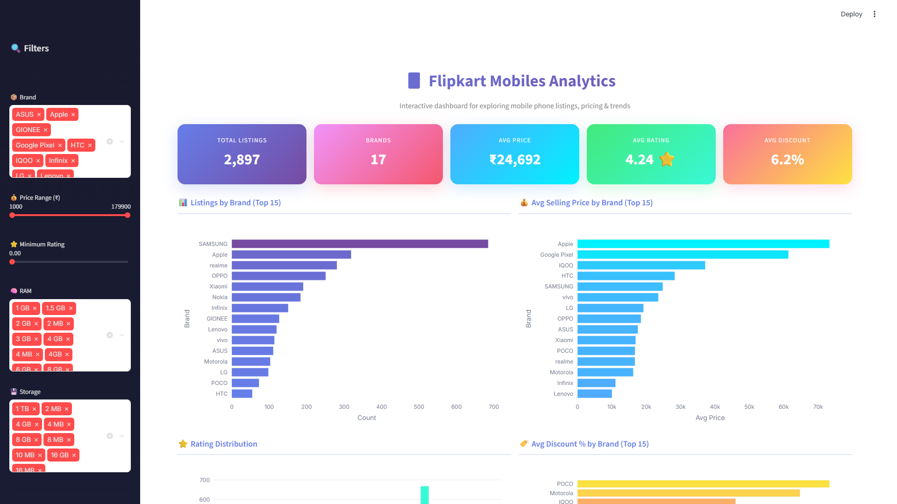
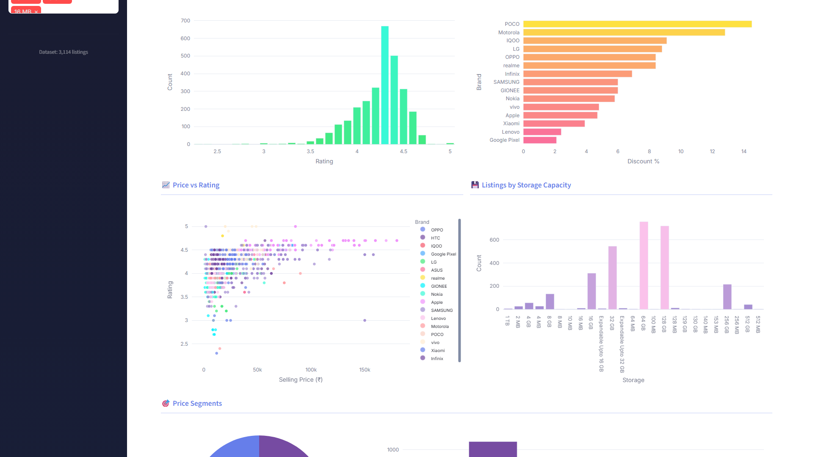
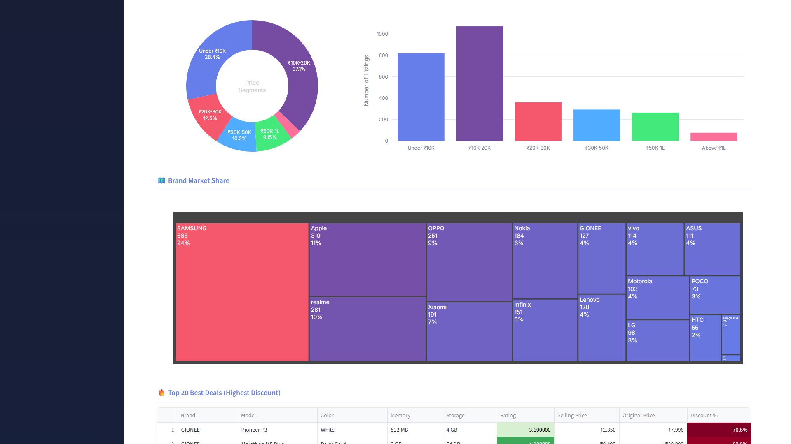
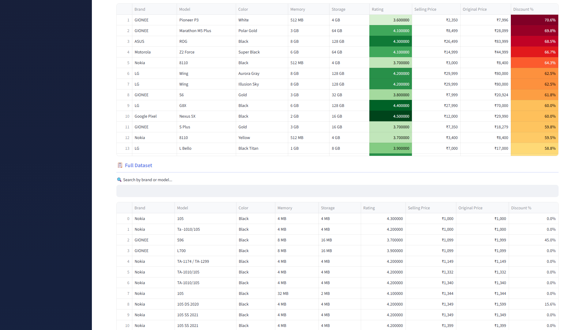
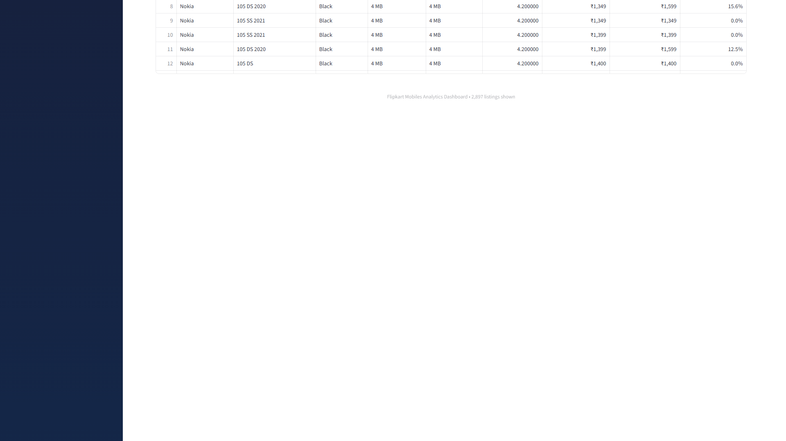

# Flipkart Mobiles Analytics Dashboard

An interactive analytics dashboard built with **Streamlit** and **Plotly** for exploring the Flipkart Mobiles dataset — pricing trends, brand comparisons, discount analysis, and more.

## Dataset

**Source:** [Flipkart Mobiles Dataset on Kaggle](https://www.kaggle.com/datasets/devsubhash/flipkart-mobiles-dataset)

The dataset contains **3,114 mobile phone listings** from Flipkart with the following fields:
- Brand, Model, Color
- Memory (RAM), Storage
- Rating (out of 5)
- Selling Price, Original Price

## Dashboard Screenshots

### Overview — KPIs & Brand Distribution


### Rating Distribution, Discount Analysis & Price vs Rating


### Price Segments & Brand Market Share Treemap


### Top Deals Table (Highest Discounts)


### Full Searchable Dataset


## Features

- **5 KPI Cards** — Total listings, brands count, avg price, avg rating, avg discount
- **Interactive Plotly Charts** — Hover tooltips, zoom, pan on all visualizations
- **Brand Analysis** — Listings count & average selling price by brand
- **Rating Distribution** — Bar chart of rating spread across listings
- **Discount Analysis** — Average discount % by brand
- **Price vs Rating Scatter** — Color-coded by brand with model details on hover
- **Storage Breakdown** — Listings by storage capacity
- **Price Segments** — Donut chart + bar chart (Under 10K, 10K-20K, etc.)
- **Brand Market Share** — Interactive treemap visualization
- **Top 20 Best Deals** — Highest discount % with color-gradient table
- **Full Dataset** — Searchable, sortable table with all listings
- **Sidebar Filters** — Brand, price range, minimum rating, RAM, storage

## Setup

Requires Python 3.9+.

```bash
# Clone the repo
git clone https://github.com/Devjani-Pankaj/ecommerce-sales-analytics.git
cd ecommerce-sales-analytics

# Create virtual environment
python -m venv venv
venv\Scripts\activate        # Windows
# source venv/bin/activate   # macOS/Linux

# Install dependencies
pip install -r requirements.txt
```

## Run the Dashboard

1. Download the dataset from [Kaggle](https://www.kaggle.com/datasets/devsubhash/flipkart-mobiles-dataset) and place `Flipkart_Mobiles.csv` in the project root or update the `DATA_PATH` in `dashboard/app.py`.

2. Launch the dashboard:
```bash
streamlit run dashboard/app.py
```

3. Open **http://localhost:8501** in your browser.

## Tech Stack

- **Python 3.9+**
- **Streamlit** — Web dashboard framework
- **Plotly** — Interactive charts (bar, scatter, treemap, donut)
- **Pandas** — Data processing and analysis
- **Selenium** — Automated screenshot capture

## Project Structure

```
ecommerce-sales-analytics/
├── dashboard/
│   └── app.py              # Streamlit dashboard (main app)
├── screenshots/            # Dashboard screenshots for README
├── src/                    # Data processing modules
├── requirements.txt        # Python dependencies
└── README.md
```

## License

This project is for educational and portfolio purposes.
